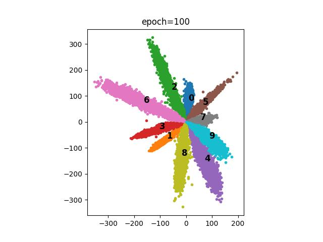
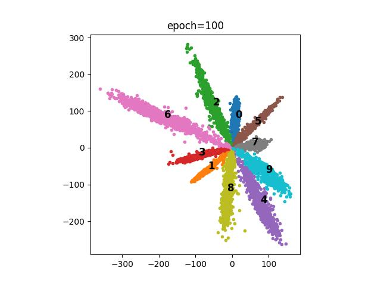
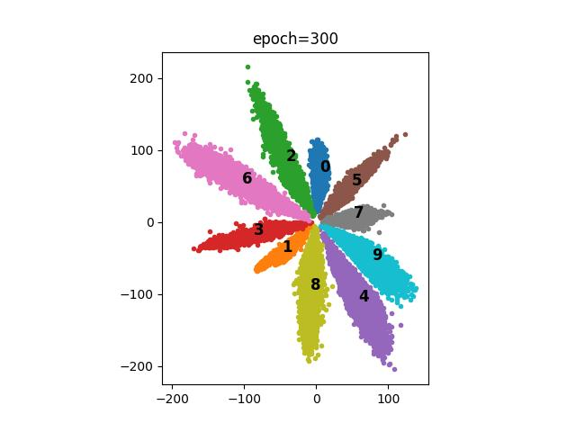
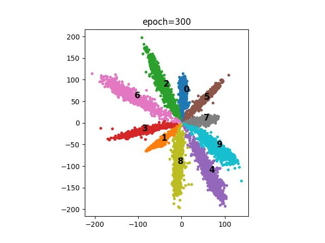
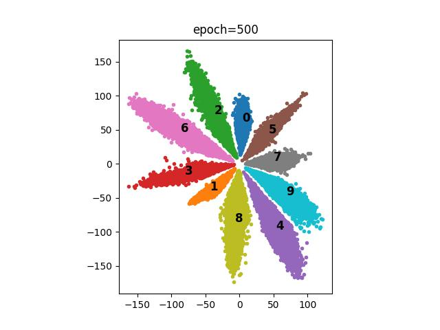
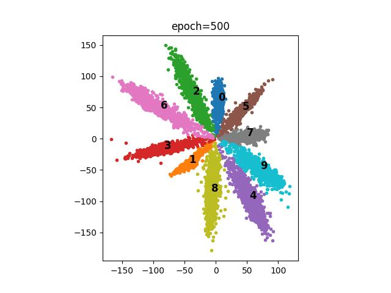

# LossFunctions

## 1. Softmax Loss

   
   
   

## 2. L2-Softmax Loss
Refer to paper: [L2-constrained Softmax Loss for Discriminative Face Verification](https://arxiv.org/pdf/1703.09507.pdf).

**Summary:**
- L2 normalize and scale the features
- Regular SoftmaxLoss
- Lower bound alpha: $\alpha_{low} = log \frac{p(C-2)}{1-p}$

   
   
   

## 3. Ring Loss
Refer to paper: [Ring loss: Convex Feature Normalization for Face Recognition](https://arxiv.org/pdf/1803.00130.pdf).

**Summary:**

- L2 normalize weights of the last FC layer
- An auxiliary loss that should be used with SoftmaxLoss/A-SoftmaxLoss, etc.
- $$
  \begin{aligned} 
  L_R &= \frac{\lambda}{2m} \sum_{i=1}^{m} (||F(x_i)||_2 - R)^2 \\
  \frac{\part L_R}{\part R} &= - \frac{\lambda}{m}(||F(x_i)||_2 - R) \\
  \frac{\part L_R}{\part F(x_i)} &= \frac{\lambda}{m}(1 - \frac{R}{||F(x_i)||_2})F(x_i)
  \end{aligned}
  $$

   
   
   

