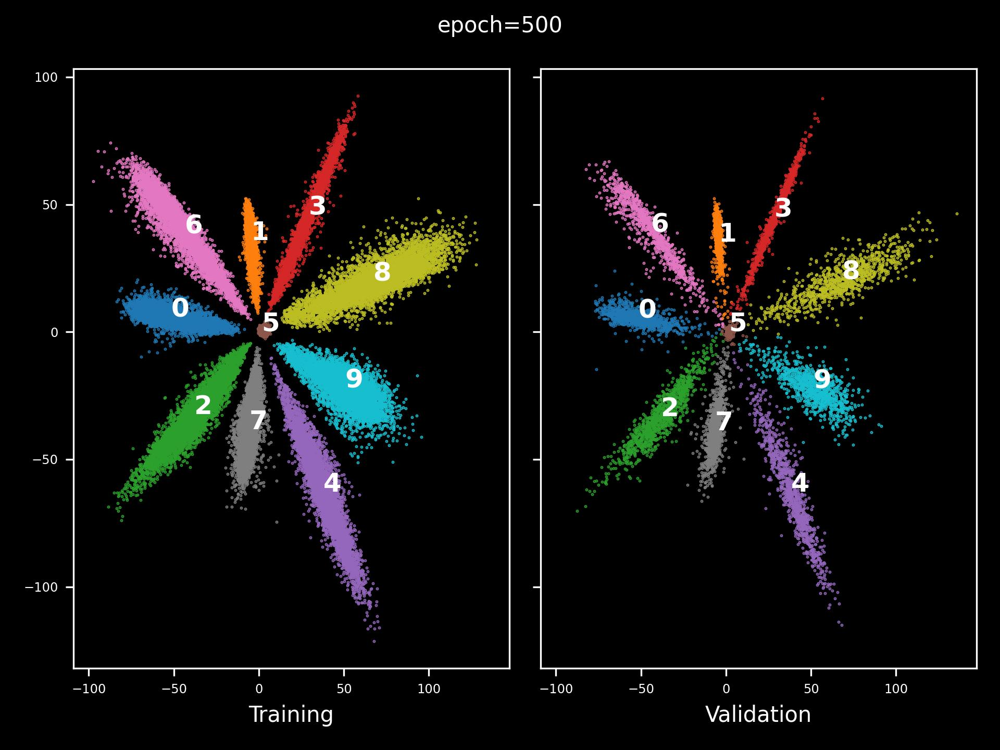
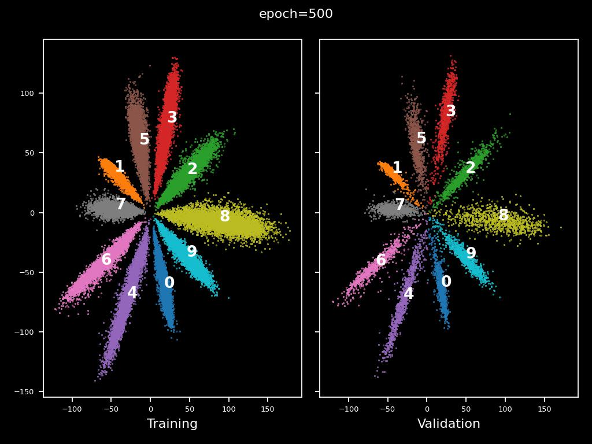
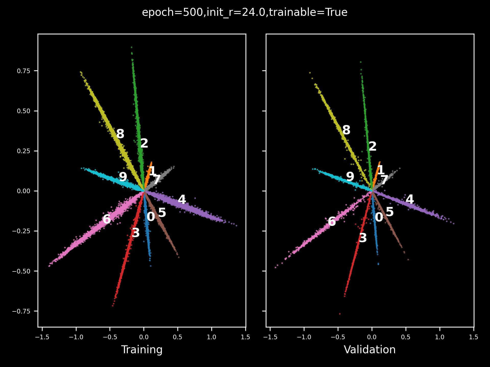
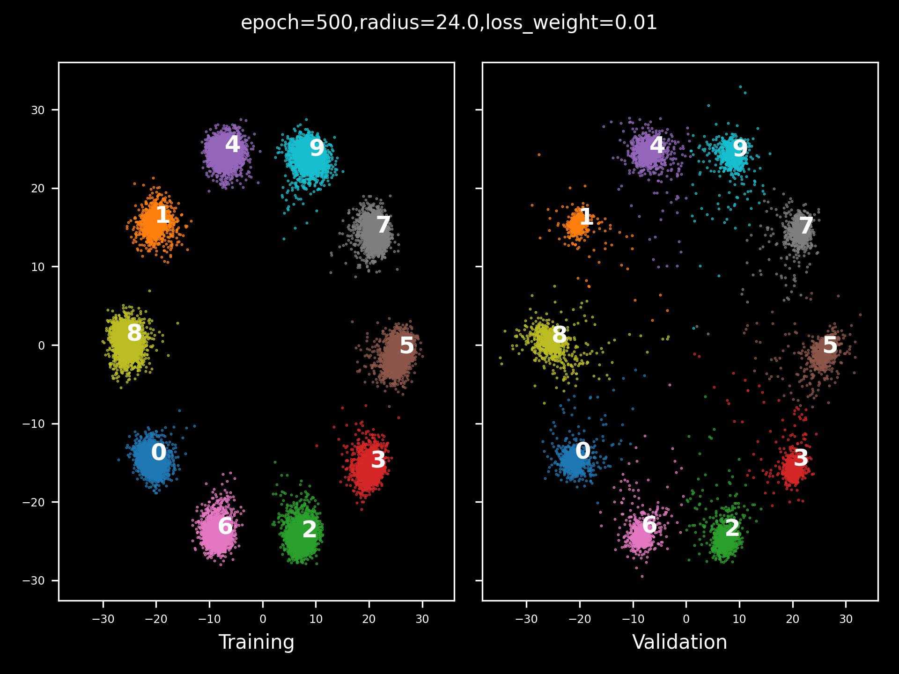

# 人脸识别常用损失函数

## 1. Softmax Loss

分类最常用的损失函数，公式如下：<br>
$L_{sm} = - \frac{1}{m} \sum_{i=1}^{m} log (\frac{e^{w_{y_i}^Tx_i + b_{y_i}}}{\sum_{j=1}^{K} e^{w_j^Tx_i + b_j}})$

**Q：在人脸识别中，为什么一般最后一层FC层不使用bias？**<br>
A：人脸识别Pipeline中，最后需要对比特征提取后的特征向量之间的距离。当使用bias时，模型可以学到w为0且只使用bias进行分类的特征，从而出现两个不同类的特征具有相同夹角的情况，造成误识。

使用 bias:


不使用 bias：


**Q：为什么需要特征归一化？**<br>
A：参考论文 [NormFace: L2 Hypersphere Embedding for Face Verification](https://arxiv.org/pdf/1704.06369.pdf)的分析：

- 余弦相似度是一种与特征模长无关的度量，可视为归一化的向量内积。测试阶段一般将特征向量归一化，然后计算相似度，但在模型训练阶段不会对特征进行归一化，存在训练与测试不统一的情况
- 经验证，使用归一化的特征比没有归一化的特征的识别准确率更高

**Q：什么不能将特征和权重同时归一化？** <br>
A：根据 **NormFace**论文的观点分析：

- Proposition 1：**不使用bias** 时，P(sf) >= P(f) 总是成立，其中s是 >1 的标量。预测概率越大则loss越小，这说明 softmax loss
  总是鼓励可区分的特征具有更大的模长，因此通过归一化特征可以去除softmax loss的这种特性
- Proposition 2: SoftmaxLoss下届：$log(1+(n-1)e^{-\frac{n}{n-1}l^2})$, 其中 n 表示类别数，l 表示特征或者权重的模长。从 $loss-l^2$
  的函数图像可以看到，当 l 很小时，loss的下届总是很大，从而导致训练发散。
- 实际上，应该在特种和权重归一化后，使用一个放大因子s（一般取较大整数，如32，64等）将模长放大，从而可以使loss的下届降到0，公式为： $Ls = - \frac{1}{m} \sum_{i=1}^m log \frac{e^{s \hat W_{y_i}^T \hat f_i}}{\sum_{j=1}^K e^{s \hat W_j^T \hat f_i}}$

---

## 2. L2-Softmax Loss

参考论文: [L2-constrained Softmax Loss for Discriminative Face Verification](https://arxiv.org/pdf/1703.09507.pdf).

**总结:**

- 出发点：
    - 人脸识别的训练和测试阶段是解耦的，使用Softmax Loss训练不能确保正负样本的特征向量在归一化空间内离得很远
    - Softmax分类器对难样本较弱，在一个batch中，倾向于增加简单样本的L2范数来降低loss，从而忽略了难样本，因此模型学会了通过特征L2范数来反映人脸质量高低的情况。
- 实施：
    - 对特征施加L2约束，使得它们分布在一个固定半径的超球面上： $\parallel f(x_i) \parallel _2 = \alpha$
    - ```mermaid
       flowchart LR
           A(Input) --> B(L2 Normalize Layer) --> C(Scale Layer) --> D(SoftmaxLoss)
      ```
- 参数$\alpha$
    - 过大则导致放松了L2约束；过小则导致不收敛
    - 可以使用固定值可以是可学习的参数，通过固定$\alpha$到其下界会获得较好的结果
    - 理论下届公式：$\alpha_{low}=log \frac{p(C-2)}{1-p}$
    - 经验证，$\alpha$ 处于范围 [16, 32] 都能获得几乎一致的效果；若是可学习参数则效果稍有降低



## 3. Ring Loss

参考论文: [Ring loss: Convex Feature Normalization for Face Recognition](https://arxiv.org/pdf/1803.00130.pdf).

**总结:**

- 动机：
    - 特征归一化能有效提高识别准确率，因为它能使模型对于每一个类都具备同等表达能力，但直接归一化具有非凸性，会导致损失函数产生局部最小值
    - 为了消除特征模长对loss值的影响，L2-SoftmaxLoss将特征进行了归一化，但这种loss的计算方式仅仅只是看起来像是对特征进行了归一化，但实际上模型没有学习到归一化的特征
- 贡献：
    - 论文提出一种特征归一化方法用来增强标准损失函数（如Softmax, L-Softmax等）的凹凸性。也就是说，Ring
      Loss是一个辅助损失函数，配合标准loss函数使用，唯一的超参数是 $\lambda$ (loss weight)
    - 最终模型将学会直接使用自身的权重学会对特征进行归一化（而不是直接施加非凸的归一化函数）
    - 公式： $L_R = \frac{\lambda}{2m} \sum_{i=1}^{m}(\parallel f(x_i) \parallel _2 - R)^2$，其中R是可学习参数
- 结论：
    - 使用Softmax + RingLoss 当 $\lambda=0.01$ 时超过了L2-Softmax Loss



## 4. L-Softmax Loss

参考论文：[Large-Margin Softmax Loss for Convolutional Neural Networks](https://arxiv.org/pdf/1612.02295.pdf)

**总结：**

- 动机：
    - 多数视觉任务中，固有地存在类内方差大的特点，而最常用的损失函数SoftmaxLoss没有显示地鼓励“类内聚集，类间分散”
    - 使用SoftmaxLoss时，标签预测的决策规则主要是由类间的角度相似性决定的。通过增加一个预设的常数m，将m与样本和分类器的权重的角度相乘，将使得特征之间的具有更大的可区分性，即：
        - $\parallel W_1 \parallel \parallel x_i \parallel cos(m\theta_1) \ge \parallel W_2 \parallel \parallel x_i
          \parallel cos(\theta_2)$
        - 显然，如果该公式成立，则$\theta_1$更大于$\theta_2$，对于另外一类同理，从而两个类的分界面中间产生margin，最终“类内聚集，类间分散”

- 公式：
    - $L_i=-log(\frac{e^{\parallel W_{yi} \parallel \parallel x_i \parallel \phi(\theta_{yi})}}{e^{\parallel W_{yi}
      \parallel \parallel x_i \parallel \phi(\theta_{yi})} + \sum_{j \neq y_i} e^{\parallel W_j \parallel \parallel x_i
      \parallel \phi(\theta_j)}})$
    - $\phi(\theta)=(-1)^kcos(m\theta)-2k, \quad \theta \in [\frac{k \pi}{m}, \frac{(k+1) \pi}{m}]$, 其中k是[0, m-1]的整数
    - $cos(m\theta_{y_i})=C_m^0cos^m(\theta_{y_i}) - C_m^2cos^{m-2}(\theta_{y_i})(1-cos^2(\theta_{y_i})) + ... + (-1)^nC_m^{2n}cos^{m-2n}(\theta_{y_i})(1-cos^2(\theta_{y_i}))^n + ...$， 其中n为整数且$2n\ge m$
- 训练时，为了降低收敛难度，使用退火策略更新: 
  - $f_{y_i}=\frac{\lambda \parallel W_{yi} \parallel \parallel x_i \parallel  cos(\theta_{yi}) + \parallel W_{yi} \parallel \parallel x_i \parallel \phi(\theta_{yi})}{1+\lambda}$
  - $\lambda$ 初始值较大，但随着迭代次逐渐减少
  - 一般而言，m的值不能过大，m=3 或 m=4 可获得较好结果。此外，L-SoftmaxLoss也有助于减轻过拟合问题

  
## 5. A-Softmax Loss
参考论文: [SphereFace: Deep Hypersphere Embedding for Face Recognition](https://arxiv.org/pdf/1704.08063.pdf)

**总结：**
- 出发点：
  - 开集人脸识别中，测试样本通常与训练样本不重叠，实际上是一个度量学习问题，其关键是学习可判别的大间隔特征，其理想的特征应满足 **最大类内距离小于最小类间距离**
  - 由SoftmaxLoss学到的特征的判别性不足，为了解决这个问题，许多其他的方法将欧式距离的间隔引入特征学习中，与SoftmaxLoss配合，如Contrastive Loss，CenterLoss，TripletLoss等，获得了很好的结果。
  - 但SoftmaxLoss学到的特征存在固有的角分布性质，因此那些基于欧式距离的loss函数与SoftmaxLoss其实并不兼容，从而论文引入了角度间隔，能更自然的与SoftmaxLoss配合来学习角分布的特征
- 实现：
  - 与L-SoftmaxLoss相似，只是归一化的权重
  - 对于多分类问题，$m_{min} >= 3$
- 附录：
  - **删除最后一层FC**的非线性ReLU激活层有助于特征学习，从直观感受上看，ReLU将特征限制在了第一象限，删除它能提供更大的可学习空间（从角度的观点看）
  - **归一化最后一层FC的权重**能减少由于训练数据不平衡导致的先验概率（如长尾分布）。试验表明，某个类如果存在更多样本，那么与那个类对应的特征的L2范数趋向于变大，从而权重的范数可视为训练数据集的先验，消除这种先验通常有利于人脸验证，因为人脸验证需求的数据不存在与训练数据集中。

